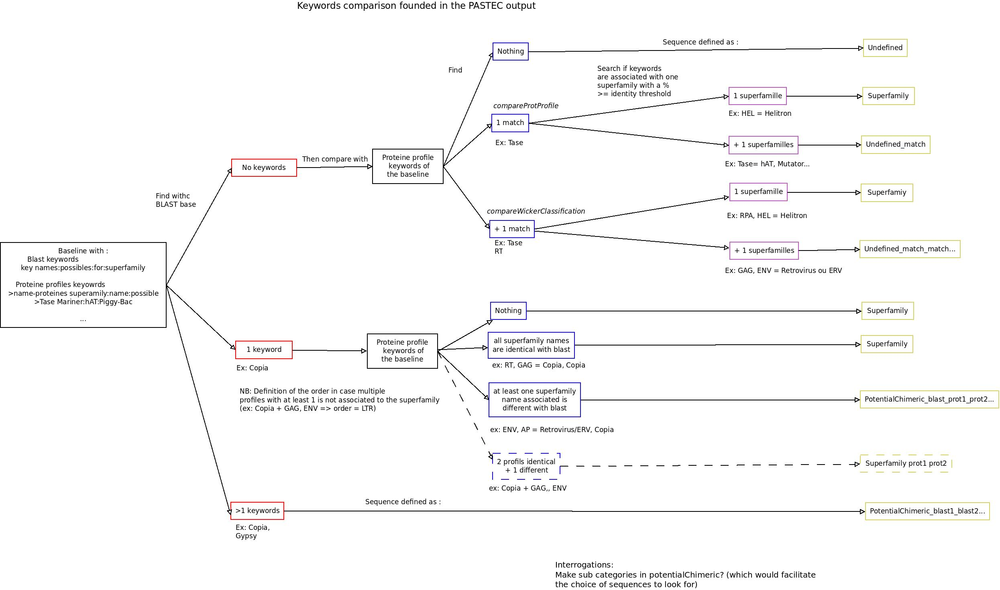

# pirateClassif

## Aim of this project :

This script is a part of the PiRATE project (that aim to analyze the Transposable Element in sequences).
The purpose of this code is to automatize the step of classification of PiRATE.

For more information, you can go read the research paper that lead to the creation of PiRATE :
_http://www.seanoe.org/data/00406/51795/_

## Files used for this script:
* ***pastecFile*** : Output file of the pastec tool. This file must be correctly written, meaning all columns are separated by one or two tabulation characters.  
The script will retrieve the class, order and superfamily for each sequence in this file.

* ***baselineFile*** : File containing the baseline of the superFamilies names (multiple names can define the same superFamily). This is useful to determine if a sequence can be classified as multiple families or if its superFamily is not defined yet. By default it is ***base&#95;reference.txt*** which is used.  
For the classification step, we used ***blast*** and ***protProfiles*** keywords. The first concerned keywords that can be find in the ***TE&#95;BLRx*** or ***TE&#95;BLRtx*** part of coding, and the last can be found in the ***profiles*** part.  
This file can be completed, for this, you just need to enter the new family name in a new line followed by a _tabulation_ and the different names (separated by ***:*** ) that can design this superfamily.  
> Example :  
> Mariner&nbsp;&nbsp;&nbsp;&nbsp;Tc1-mariner:mariner:TASE  
> &gt;TASE&nbsp;&nbsp;&nbsp;&nbsp;Mariner:hAT:PIF-Harbinger:PiggyBac:Merlin:Transib:CACTA:P

* ***fastaFile*** : File containing the fasta sequences used to run PASTEC tool. Usefull to retrieve the sequences after the classification has be done.

## Command line to launch the script:
Four arguments can be passed onto the command line but two arguments are mandatory, the third and the fourth are optionnal.
1. The first is the **output** file of PASTEC, usually with an extension ***.txt***
2. The second is the **fasta** file used for PASTEC, usually with an extension ***.fasta***
3. The third is the identity threshold (in percentage) by which the superFamily name will be determined for a sequence. By default it will be ***100&#37;*** but it can be changed with the argument ***-e***.
4. The fourth is the **baseline** file, by default it will be ***base&#95;reference.txt*** but it can be changed with the argument ***--baseline*** followed by the name of the new baseline file to use.

Hence multiple command line can be used to launch the script
> python3&nbsp;&nbsp;path/toward/this/script&nbsp;&nbsp;path/toward/the/classif/file  path/toward/the/fasta/file  
> example:

~~~{bash}
python3 src/scriptClassif.py ArabiTEdenovo.txt ArabiTEdenovo.fasta
python3 src/scriptClassif.py ArabiTEdenovo.txt ArabiTEdenovo.fasta -e 75
python3 src/scriptClassif.py ArabiTEdenovo.txt ArabiTEdenovo.fasta --baseline new_base_reference.txt
python3 src/scriptClassif.py ArabiTEdenovo.txt ArabiTEdenovo.fasta -e 75 --baseline new_base_reference.txt
~~~

 
It can also be launched by executing itself (be sure the permission for execution are granted for the script)

> ./path/toward/the/scriptClassif.py&nbsp;&nbsp;path/toward/the/classif/file path/toward/the/fasta/file  
> example:

~~~{bash}
./src/scriptClassif.py ArabiTEdenovo.txt ArabiTEdenovo.fasta
~~~

 
For help, you can type the command

~~~{bash}
python3 scriptClassif.py -h
~~~

## What this script do?
This script will retrieve interesting informations from the output file of PASTEC (namely the class, order and superFamily of the sequence).
Before these informations are determined, the type of the sequence is first established, four outcomes are possible:
1. **noCat** : the sequence can't be categorized
2. **nonTE** : the sequence is not a Transposable Element (can be PotentialHostGene)
3. **PotentialChimeric** : the sequence can be categorized as 2 or more superFamilies
4. **TE** : the superFamily's sequence has been established

According the type of the sequence, the script will determine the class, order, and superFamily of the pastec output.

## How the superFamily determination work:
The diagram above show the diffent possibilities which can be founded during the keywords comparison used for the superFamily determination.

